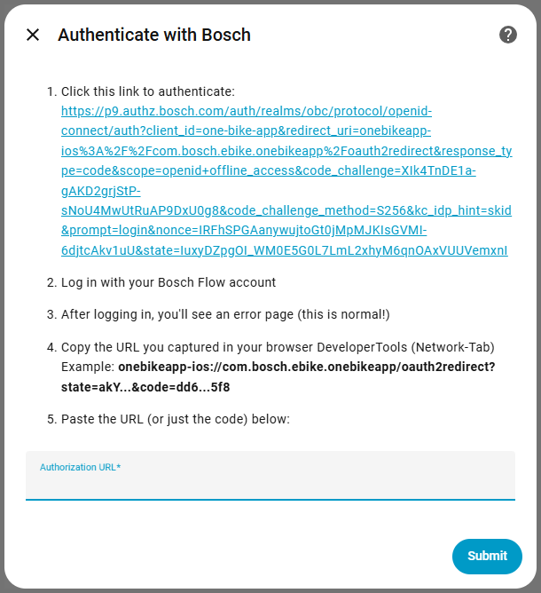
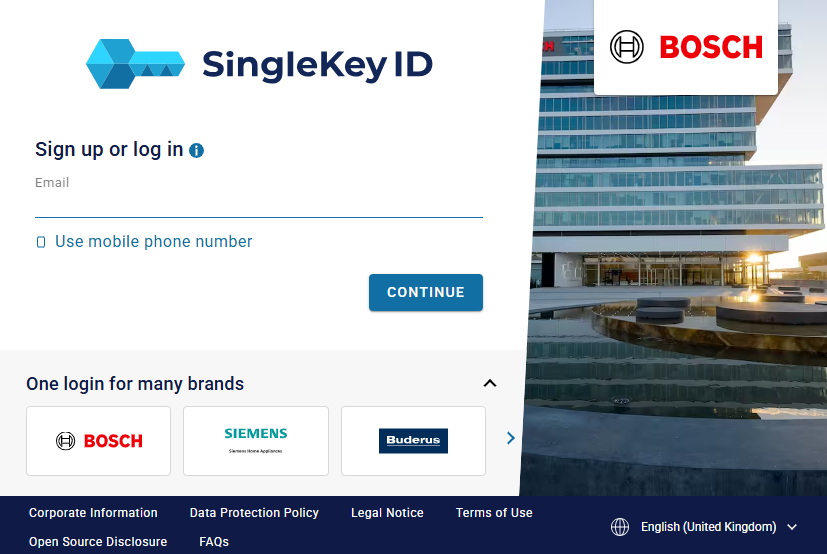
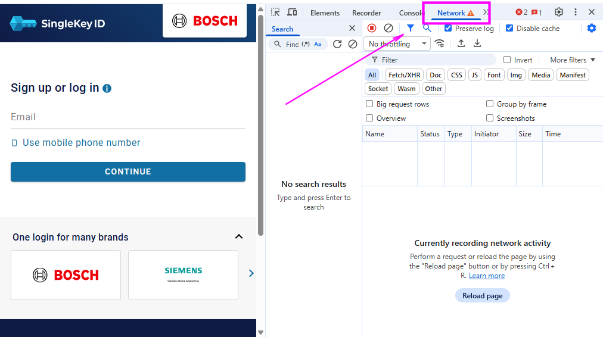
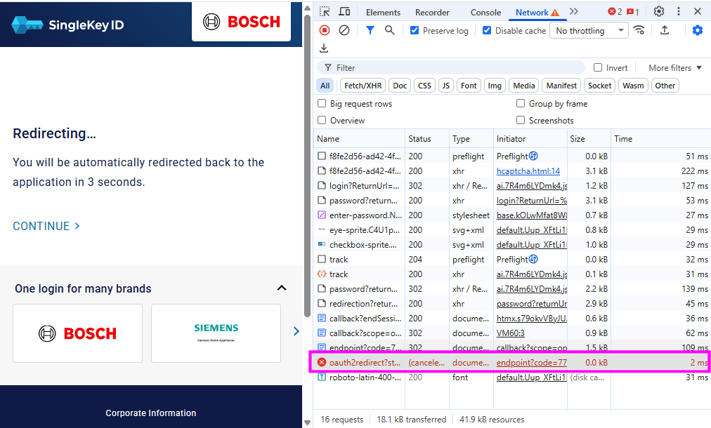
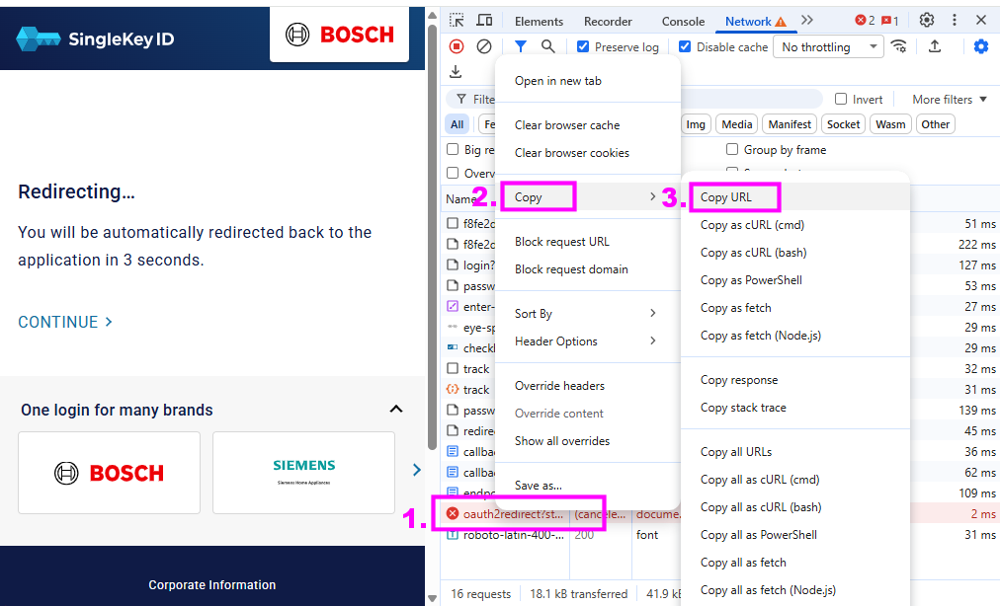
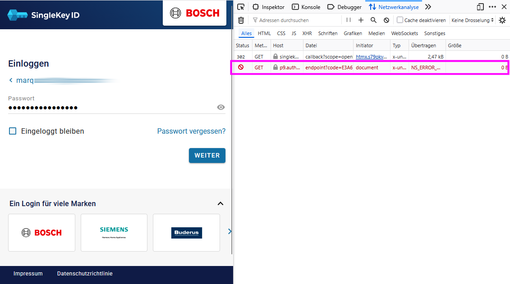
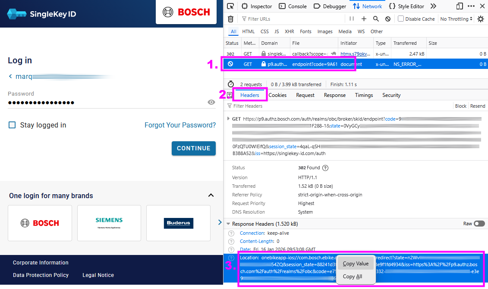
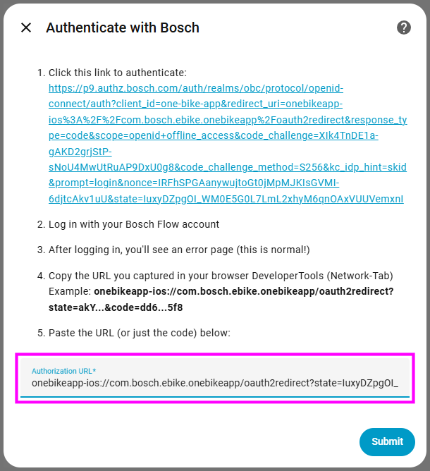
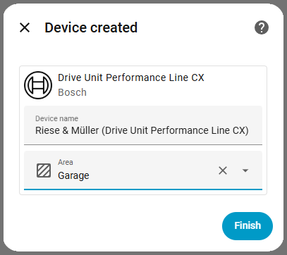

# Authentication Guide for Bosch eBike Flow Integration

This guide will help you through the authentication process step-by-step.

> [!WARNING]  
> ## Use a Desktop/Laptop Browser

__DO NOT use your phone or tablet!__ The authentication flow requires browser developer tools, which are not available on mobile devices. Additionally, mobile devices will automatically open the Bosch Flow app when redirected, preventing you from seeing the authorization code.

__Supported browsers:__

- ✅ Chrome (Windows, Mac, Linux)
- ✅ Firefox (Windows, Mac, Linux)
- ✅ Edge (Windows, Mac)
- ✅ Safari (Mac)
- ❌ Mobile browsers (iPhone, iPad, Android) - __WILL NOT WORK__

## Step-by-Step Instructions

### Step 1: Start the Integration Setup

click the Button<br/> 

[](https://my.home-assistant.io/redirect/config_flow_start/?domain=bosch_ebike)

_or_

1. In Home Assistant, go to __Settings__ → __Devices & Services__
2. Click __"+ ADD INTEGRATION"__
3. Search for __"Bosch eBike Flow"__
4. Click on it to start the setup

<table><tr><td></td></tr></table>

### Step 2: Copy the Authorization URL

You'll see a long URL starting with `https://p9.authz.bosch.com/auth/realms/obc/protocol/openid-connect/auth...`

You can click on the link directly, __but you must make sure that the URL opens in a new browser tab.__ If the link opens in the same tab/browser window, then you __must__ follow the following sequence instead: 

1. __Highlight the entire URL__ by triple-clicking on it
2. __Copy it__ (Ctrl+C on Windows/Linux, Cmd+C on Mac)
3. __Open a new browser tab__
4. __Paste the URL__ into the address bar
5. __Press Enter__

### Step 3: Log In to Bosch

1. You'll be taken to the Bosch login page<br><table><tr><td></td></tr></table>

2. __IMPORTANT__: Now open the developer Tools of your desktop/laptop browser and select the __Network__ tab as the active view.

    __Windows/Linux:__
    
    - Press __F12__, or
      - Right-click anywhere on the page → __"Inspect"__, or
      - Press __Ctrl+Shift+I__
    
    __Mac:__
    
    - Press __Cmd+Option+I__, or
      - Right-click anywhere on the page → __"Inspect Element"__
    
    <br/>A panel will appear at the bottom or side of your browser window.

   <br/>__Find the Network Tab__

    1. Look at the top of the developer tools panel
    2. Click on the __"Network"__ tab
        - It might be between other tabs like "Elements", "Console", "Sources"

    <br/>Your screen should now look similar to this:<br><table><tr><td></td></tr></table>

3. Once you have prepared this, you now can enter your __Bosch eBike Flow__ account email and password
   - This is the same account you use in the Flow mobile app

4. Click "__CONTINUE__" (or "__Sign In__" or "__Log In__")

### Step 4: The Redirect "Failure" (This is Normal!)

After logging in, one of three things will happen:

#### Option A: Blank page or error message

- This is __perfect!__ Continue to Step 5.

#### Option B: Page with "Cannot open page" or similar

- This is also __perfect!__ Continue to Step 5.

#### Option C: Nothing happens

- The page might just sit there. That's okay, continue to Step 5.

Don't worry – this "failure" is expected because your browser doesn't know how to handle the `onebikeapp-ios://` redirect.

Now we need to find the authorization URL hidden in the failed redirect:

### Step 5: Find the Authorization URL in the browser developer tools...

Look for a request in the list that starts either with:
- __oauth2redirect...__
- __onebikeapp-ios...__
- __p9.authz.bosch.com/auth...__
- __endpoint?code=...__

__Chrome/Edge:__
<table><tr><td></td></tr></table>

1. Look in the "Name" column for `oauth2redirect?`
2. Right-Click on the column to open the context menu
3. Then select "__Copy__" and
4. Then "__Copy URL__" from the top
5. You'll get something like: `onebikeapp-ios://com.bosch.ebike.onebikeapp/oauth2redirect?code=XXXXX`

<table><tr><td></td></tr></table>

__Firefox:__
<table><tr><td></td></tr></table>

1. Look for `p9.authz.bosch.com/auth...` (_Domain_ colum) or `endpoint?code=...` (_File_ colum) in the Network tab click on it so that the request details become visible
2. Make sure that the headers tab is selected
3. Look at the  __Response Headers__ section (at the bottom) for the __Location__ field.
4. You'll see: `onebikeapp-ios://com.bosch.ebike.onebikeapp/oauth2redirect?code=XXXXX`
5. Right-click on the location header field to open the context menu and select __"Copy Value"__ (to copy the value of the _location response header_ field.
6. You'll get something like: `onebikeapp-ios://com.bosch.ebike.onebikeapp/oauth2redirect?code=XXXXX`

<table><tr><td></td></tr></table>

<!-- __Safari:__

1. Look for `onebikeapp-ios` in the list
2. Click on it
3. The URL will be shown at the top
4. You'll see: `onebikeapp-ios://com.bosch.ebike.onebikeapp/oauth2redirect?code=XXXXX`

-->
__Example URL:__
```text
onebikeapp-ios://com.bosch.ebike.onebikeapp/oauth2redirect?state=IqQ4AFTFvd-...-....&session_state=c58ec3b6-7fb5-4329-8a3f-55e626853420&iss=https%3A%2F%2Fp9.authz.bosch.com%2Fauth%2Frealms%2Fobc&code=1a8e6b0b-....-....-....-...-....
```
The actual `code` and `state` values are much longer...

<!--
### Step 8: Copy the Code

The code is the long string of characters after `code=` in the URL.


__What to copy:__ Only copy everything after `code=`, which would be:

```text
eyJhbGciOiJSUzI1NiIsImtpZCI6IjEyMzQ1...
```

__The code will be LONG__ - usually 500-1000+ characters. That's normal!

-->

### Step 6: Paste the caputed URL into Home Assistant

1. Go back to your Home Assistant tab
2. __Paste the copied URL__ into the "__Authorization URL__" field
<table><tr><td></td></tr></table>

3. Click "__Submit__"

### Step 7: Select Your Bike

If you have multiple eBikes registered in your Flow account:

1. Select which bike you want to add
2. Click __"Submit"__

Done! Your eBike should now appear in Home Assistant.

<table><tr><td></td></tr></table>

## Common Issues

### "I don't see onebikeapp-ios in the Network tab"

__Try this:__

1. Make sure you're on the __Network__ tab (not Console or Elements)
2. Scroll through the list - it might be near the bottom
3. Try refreshing the page (F5) and look for new requests
4. The request might be marked in red (that's normal - it's a "failed" redirect)
5. Look for anything that says "oauth2redirect" or starts with "onebikeapp"

### "I used my phone and it opened the Flow app"

This is why we say __you must use a desktop browser!__ Mobile devices intercept the redirect and open the app automatically, so you never see the code.

__Solution:__ Start over on your desktop/laptop computer.

### "My code doesn't work / Authentication failed"

This is the most common issue. Here's how to diagnose:

#### 1. Check Home Assistant Logs

- Go to __Settings__ → __System__ → __Logs__
- Search for `bosch_ebike` or `authentication`
- Look for error messages like:
  - `Token exchange failed (400): invalid_grant` - __Code expired or already used__ (most common!)
  - `Token exchange failed (401)` - Authentication issue
  - Other specific errors

#### 2. Common causes

##### Code expired (most common)

- OAuth codes typically expire in __60-90 seconds__
- From the moment you see the failed redirect, you have ~1 minute
- __Solution:__ Start over and paste the code immediately

##### Code already used

- You can only use each code once
- If you tried before and it failed, you need a new code
- __Solution:__ Start over from Step 1 to get a fresh code

##### Missing characters

- The code is __VERY long__ (500-1000+ characters)
- It contains dots/periods (.) and hyphens (-) - these are important!
- __Solution:__ Triple-click the URL to select all, or carefully drag-select the entire code

##### Extra characters

- Make sure when you paste, there are no:
  - Spaces at the beginning or end
  - Line breaks or newlines
  - The text `code=` itself (just the value after it)
  - URL encoding like `%3D` or `%2F`

#### 3. How to succeed

1. Have Home Assistant config flow open and ready
2. Open browser with Developer Tools already open on Network tab
3. Paste the auth URL and log in quickly
4. As soon as you see the failed redirect, copy the code immediately
5. Paste it in Home Assistant within 30 seconds
6. Click Submit

#### 4. Still not working?

- Share the error from Home Assistant logs
- Report on [GitHub Issue](https://github.com/marq24/ha-bosch-ebike-flow/issues)

### "I don't have a desktop/laptop computer"

Unfortunately, this authentication method requires desktop browser developer tools. Alternatives:

1. __Borrow a friend's computer__ - you only need to do this once during setup
2. __Use a work computer__ - the setup only takes 5 minutes
3. __Remote desktop__ - If you have a remote desktop server, you can use it from your phone/tablet
4. __Wait for a mobile-friendly solution__ - We're exploring options for future versions

## Still Need Help?

- 🐛 [Report an issue on GitHub](https://github.com/marq24/ha-bosch-ebike-flow/issues)
- 💬 [Ask in GitHub Discussions](https://github.com/marq24/ha-bosch-ebike-flow/discussions)
- 📧 Include screenshots if possible!
- 📧 Include HA debu log output from the integration – this is essential for troubleshooting

## Technical Details (For Developers)

The integration uses OAuth 2.0 with PKCE (Proof Key for Code Exchange) to authenticate with Bosch's identity service.

__Why this manual process?__

Bosch's OAuth implementation uses a mobile app deep link (`onebikeapp-ios://`) as the redirect URI. Since Home Assistant can't register as a handler for this URL scheme, the redirect "fails" in the browser, but the authorization code is still visible in the network request. This is a common workaround for reverse-engineered APIs that weren't designed for third-party integrations.

__Future improvements:__

Potential solutions being explored:

- Custom redirect URI (requires finding/registering one with Bosch)
- Proxy server to intercept redirects (adds complexity/hosting)
- Direct API token generation (if Bosch provides a developer program)
